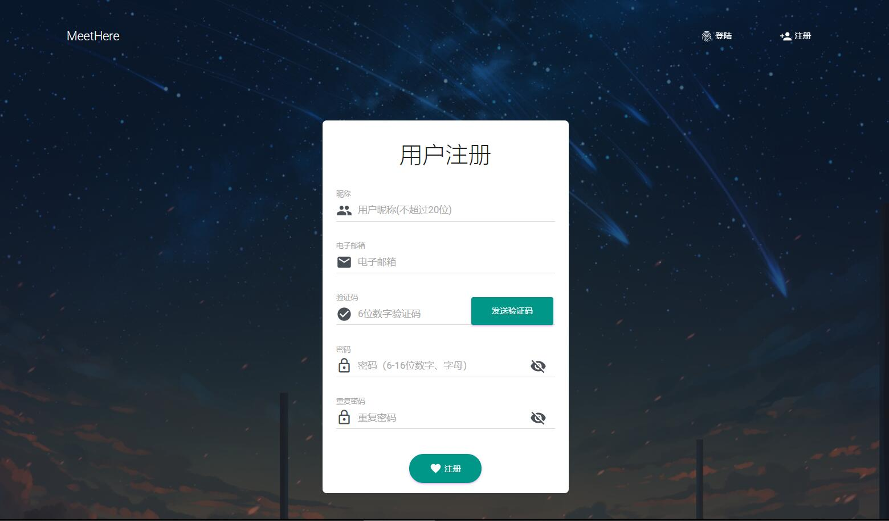
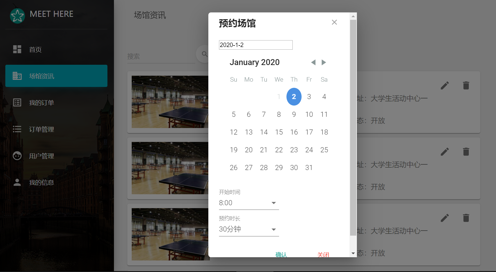

# Meethere_Doc

> 软件测试期末项目提交与展示入口仓库。
> 完成于2019年末，2020年初。

## 小组成员及工作

| name  |  works    |
|---------|------------------|
|兰于权 ( 10175101226 ) |  项目策划与需求制定、后端、单元测试、系统测试    |
|彭锋 ( 10175101126 )      |  后端、集成测试、系统测试        |
|钟天景 ( 10175101117 )      |  前端、系统测试      |
|莫锦波 ( 10175101120 )      |  后端、性能测试      |

## 项目导航

+ [本仓库为](https://github.com/LEODPEN/Meethere_Doc)需求、测试等（报告）文档汇总仓库。

+ 为后端及测试代码仓库见[Meethere_Backend](https://github.com/Onion12138/Meet)。

+ 前端代码仓库见[Meethere_Front](https://github.com/TimGin117/MeetHereFront)。

+ 项目演示：[普通用户视角](http://ecnuonion.club/%E5%BD%95%E5%B1%8F%EF%BC%88%E7%94%A8%E6%88%B7%EF%BC%89.mp4?e=1603941654&token=SStPJbNpriAFEzb0LvB1ooO7X__CB5xpwt8cE8UE:WZaOz6Yo93EBUMA7vSf0ethLZ_Q=)；[管理员视角](http://ecnuonion.club/%E5%BD%95%E5%B1%8F%EF%BC%88%E7%AE%A1%E7%90%86%E5%91%98%EF%BC%89.mp4?e=1603942160&token=SStPJbNpriAFEzb0LvB1ooO7X__CB5xpwt8cE8UE:D1lNrp8BfImYx_L3pngRcwy9_Xw=)。

## 仓库包含文档

+ Meethere需求报告.docx

+ Meethere系统测试报告v2.0.doc

+ Meethere系统测试用例计划书.xlsx

+ Meethere性能测试计划.docx

+ Meethere系统性能报告.docx s

+ coverage ( 覆盖度报告 )

+ static analyze ( 静态分析报告 )

+ 性能测试脚本与report

## 项目部分成品截图

> 更多内容截图见前端仓库；此外可见三分钟视频或直接尝试

## 其他

+ 性能测试使用并发来压缩时间，故吞吐量有一定程度下降。

+ 如有其他问题请于`issues`提出或与此仓库拥有者联系。
